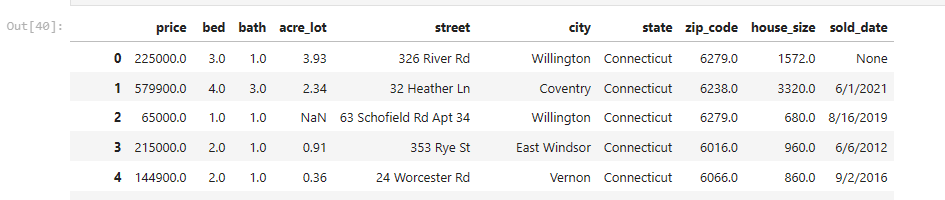
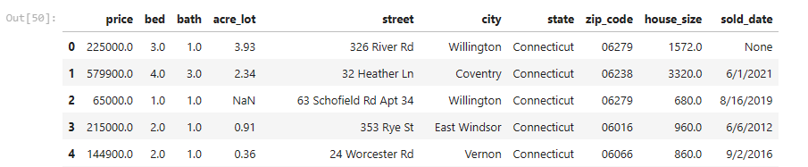
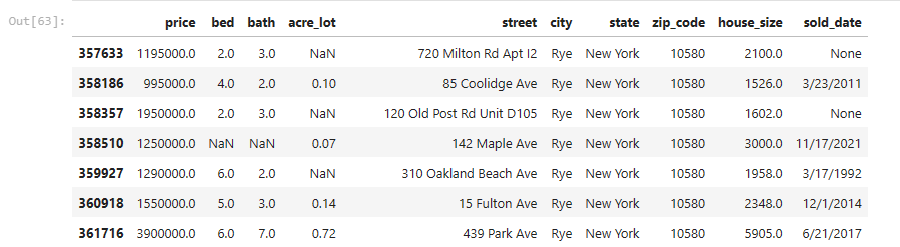
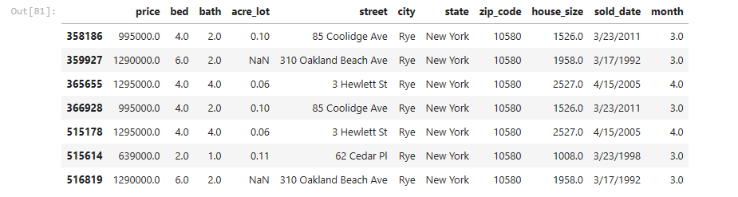
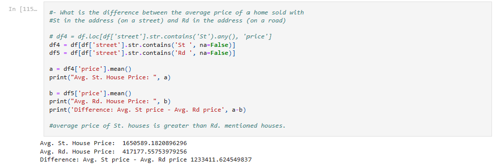
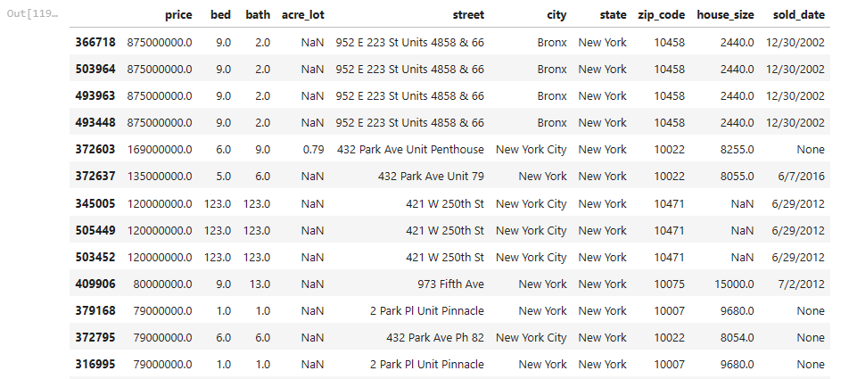
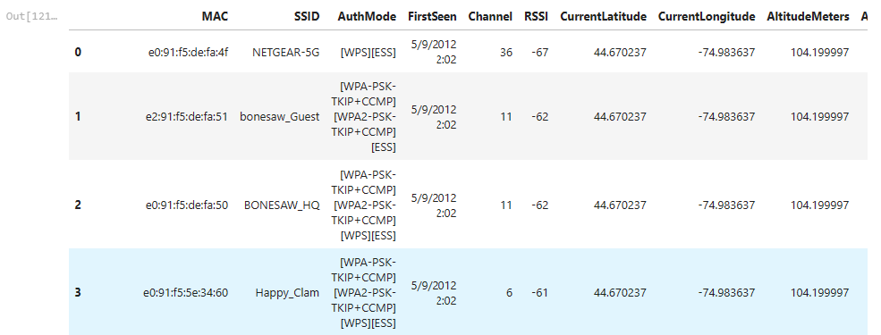
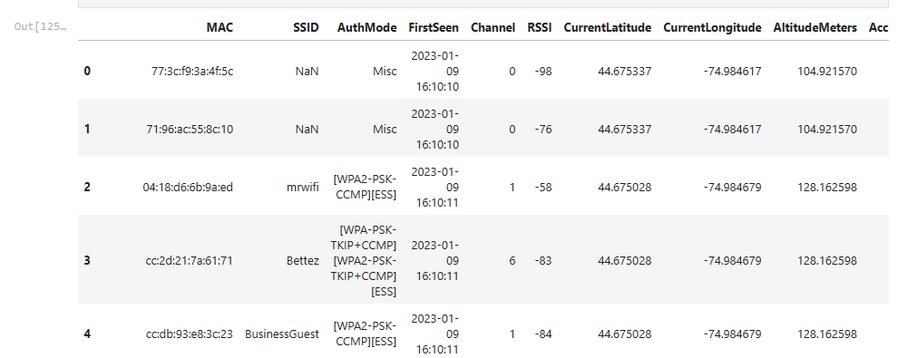
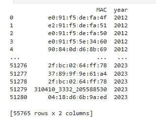

### Applied Machine Learning

1. Data Manipulation

In the tasks manipulation task, we are supposed to load dataset in .parquet format(columnar storage file, widely used in big data processing, good for compression, column encoding and more) and do the following operations on file. In this case we will use two files to read data from: 
#### Load data 

```python
import pandas as pd 
df = pd.read_parquet('northeast_realestate.parquet')
df
```


Replace the zipcode with a zero padded string as zipcode is 5 digit number in US
```python
df['zip_code'] = df['zip_code'].astype(str).str.split('.').str[0]
df['zip_code'] = df['zip_code'].str.zfill(5)
df.head(10)
```


Looking for unique properties in Rye (city), NY (state)

```python
df2 = df[(df['city'] == 'Rye') & (df['state'] == 'New York')]
df2.head(15)
```


Show only properties sold in March and April

```python
df2['month'] = pd.DatetimeIndex(df2['sold_date']).month
warnings.filterwarnings("ignore")
df3 = df2[(df2['month'] == 3.0) | (df2['month'] == 4.0)]
df3.head(10)
```


Average price of home with street and road in its address



Which are the top 20 cities with highest home sale prices in NY? (sorted by price DESC)

```python
df6 = df[df['state'] == "New York"]
df6.sort_values('price', ascending = False).head(20)
```


### Load other dataset as separate dataframes

Loading wifi_list.csv and wifi_2023.csv
```python
df7 = pd.read_csv('wifi_list.csv')
df7.head(10)
```


```python
df8 = pd.read_csv('wifi_2023.csv',encoding='latin-1')
df8.head(10)
```


Generate a new dataframe showing only access points existing in 2012 and 2023 (use MAC as point of truth for whether the AP is new) -label the columns so you can see which attributes changed.
```python
df7['year'] = pd.DatetimeIndex(df7['FirstSeen']).year
df8['year'] = pd.DatetimeIndex(df8['FirstSeen']).year

df9 = pd.DataFrame()
df10 = df7[['MAC', 'year']]
df11 = df8[['MAC', 'year']]

df9 =df9.append(df10)
df9 =df9.append(df11)
#df9.head(50)
print(df9)
```
