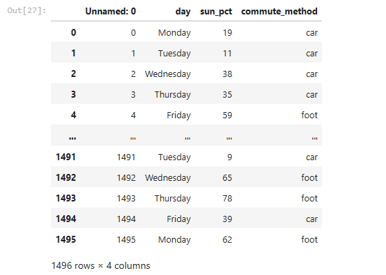
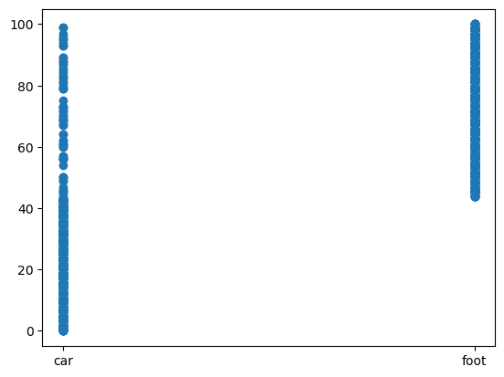
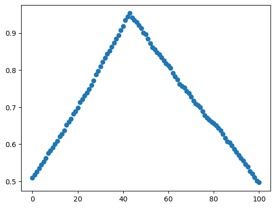
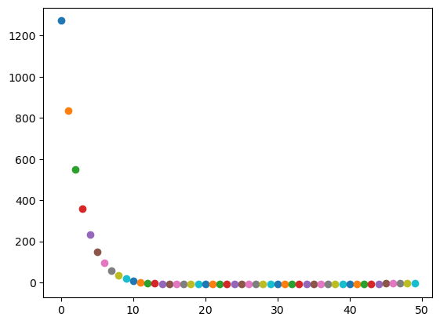
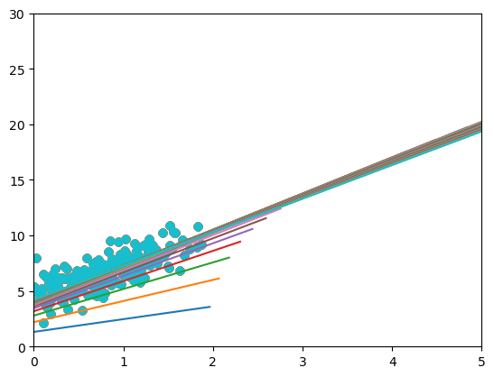
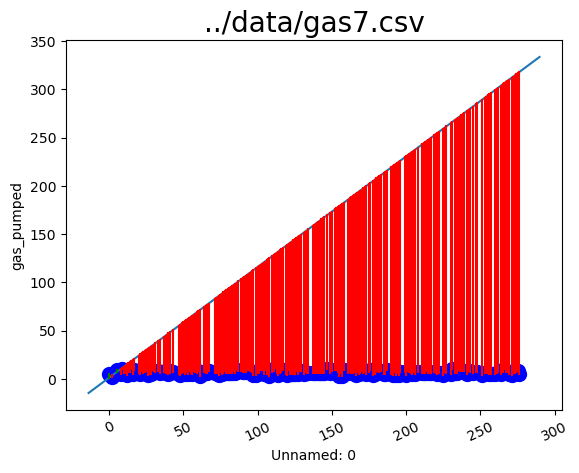

### Applied Machine Learning

1. Prediction - iterative approach

#### Load data 

```python
import pandas as pd 
df = pd.read_csv('../data/commute7.csv')
df
```


Create a scatter plot which helps to show the relationship between sun_pct and commute_type
```python
import matplotlib.pyplot as plt
plt.scatter(df['commute_method'], df['sun_pct'])
plt.show()
```


## Iterative approach
Use an iterative approach to find the best sun_pct threshold overall for the entire dataset. Where the plot shows if the sun_pct is around between 40-45 the resultant model gives best accuracy

```python
def predict(row, i, j):
    if row ['sun_pct'] > i: 
        return 'foot'
    else: 
        return 'car'
```
```python
thresh = df['sun_pct'].unique()
#thresh.shape
r = []
for t in thresh:
    df['prediction'] = df.apply(predict, args = (t, 0), axis=1)
    df['correct_int'] = (df['prediction'] == df['commute_method']).astype(int)
    result = df['correct_int'].mean()
    r.append(result)
```
```python
plt.scatter(x=thresh, y=r)
plt.show()
```




2. Gradient Descent 

Following script will show the sum of square residuals per epoch. Plot the loss (sum of squared residuals)

### Load Data
```python
import matplotlib.pyplot as plt
import numpy as np
import pandas as pd
fn = '../data/gas7.csv'
df = pd.read_csv(fn)
```

```python
def abline(slope, intercept):
    """Plot a line from slope and intercept"""
    axes = plt.gca()
    x_vals = np.array(axes.get_xlim())
    y_vals = intercept + slope * x_vals
    plt.plot(x_vals, y_vals, '-')
```
```python
X = df['vehicle_tons']
Y = df['gas_pumped']
m = 0
c = 0
n = len(X)
L = 0.1
e = 50
line_history = []
```
```python
for i in range(e):
    Y_pred = m*X + c
    D_m = (-2/n) * sum(X * (Y - Y_pred))  # Derivative wrt m
    D_c = (-2/n) * sum(Y - Y_pred)  # Derivative wrt c
    m = m-L*D_m
    c = c-L*D_c
    plt.scatter(i,sum(X * (Y - Y_pred)))
    line_history.append([m,c,sum(X * (Y - Y_pred))])
print(m,c)
#3.0273037941713055 4.231124880724682
plt.show()
```



```python
for line in line_history:
    plt.scatter(X,Y)
    m,c,loss = line
    abline(m,c)
plt.xlim(0,5)
plt.ylim(0,30)
plt.show()
```



Plot the line and points
```python
for line in line_history:
    plt.scatter(df[df.columns[0]],df[df.columns[1]], color = 'b',s = 100)
    plt.xticks(rotation = 25)
    plt.xlabel(df.columns[0])
    plt.ylabel(df.columns[1])
    plt.title(fn, fontsize = 20)
    m,c,loss = line
    abline(m,c)
    for index, row in df.iterrows():
        #print(row[0],row[1],row[0],m*row[0] + c)
        y2 = (m*row[0] + c)
        if y2 > row[1]:
            color = 'red'
        else:
            color = 'green'
        plt.plot([row[0],row[0]],[row[1],y2],color=color)# Draw the loss distances format=[x1,x2],[y1,y2]
    print(loss)
    plt.show()
    plt.cla()
```


The best learning rate the I found was 0.1, for the purpose of demonstration i have increase the number of epochs as we are working the small number of sampled dataset which will not much effect the computational resources. 