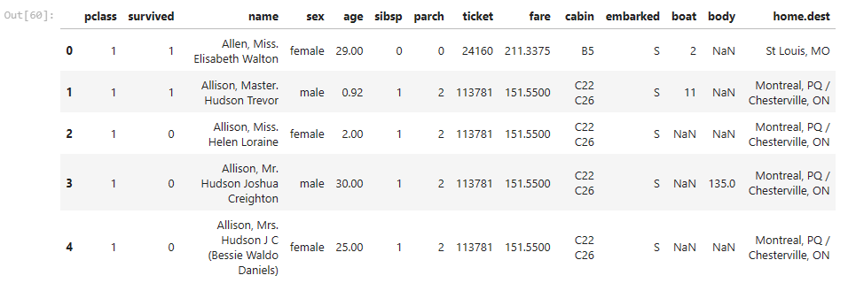
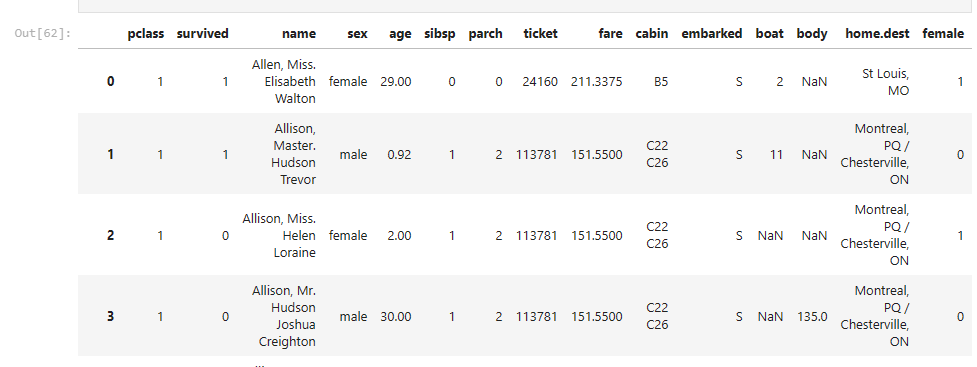
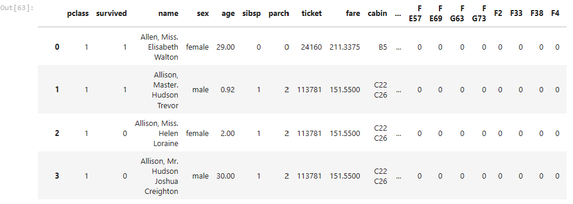
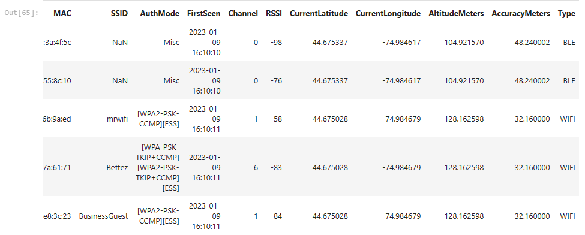
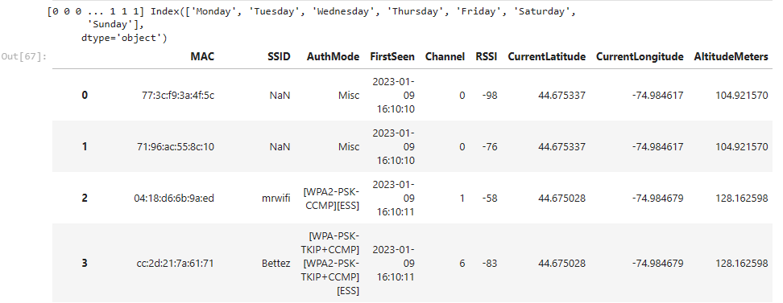
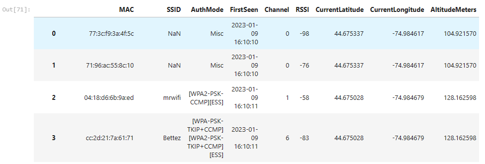

### Applied Machine Learning

1. Data Preperation

#### Load data 

```python
import pandas as pd
df = pd.read_csv('titanic_full.csv')
df2 = df.copy()
df.head()
```


## One hot encoding 
One hot encode the passenger gender(sex) field.

```python
dow_cols = pd.get_dummies(df2['sex'])
df3 = df2.merge(dow_cols,left_index=True,right_index=True) # or concat(axis=1)
df3
```


One hot encode the passenger cabin. I do the same for this as above, a merge the results into a new copy of dataset with df2

```python
dow_cols = pd.get_dummies(df2['cabin'])
df4 = df3.merge(dow_cols,left_index=True,right_index=True) # or concat(axis=1)
df4
```



Prepare a dataframe which is appropriate to predict whether a passenger survived based on age, sex, cabin and pclass.

```python
df4.drop(['name','sex', 'sibsp', 'parch', 'ticket', 'fare','cabin', 'embarked','boat','body','home.dest'], axis=1, inplace=True)
df4
```
## Load New Dataset

```python
df5 = pd.read_csv('../data/wifi_2023.csv', encoding='latin-1')
df6 = df5.copy()
df6.head()
```


Create one hot encoded day of week columns based off the firstSeen field.

```python
df6['day_of_week'] = pd.to_datetime(df6['FirstSeen']).dt.day_name()
df6
```


Creating codes for cyclic values in week using feature engineering

```python
codes,uniques = df6['day_of_week'].factorize()
print(codes,uniques)
df6['day_of_week'] = codes
df6
```


### Creating Cross feature
Create a cross feature which represents lat, lon and altitude. Make this feature categorical - it should have 10 possible values. lat*lon*altitude for example: 44.675337	-74.984617	104.921570

```python
df6['Cross'] = df6['CurrentLatitude'] * df6['CurrentLongitude'] * df6['AltitudeMeters']
df6
```


We can simply create cross feature by cross multiplying the dataframes columns lat, lon and altitude
