# Applied Machine Learning

1. Principal Component Analysis - Crop Nutrient dataset

## Load data 

```python
import matplotlib.pyplot as plt
import numpy as np
import pandas as pd
fn = 'yields15.csv'
df = pd.read_csv(fn)
df.head(10)
```
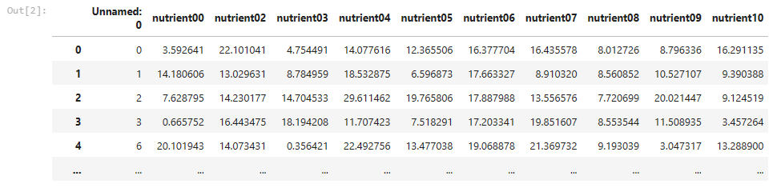

```python
x_cols = [0,1,2,3,4,5,6,7,8,9,10,11,12,13,14,15,16]
y_col = 17

for x_col in x_cols:
    plt.scatter(df[df.columns[x_col]],df[df.columns[y_col]], color = 'g',s = 10)
    plt.xticks(rotation = 25)
    plt.xlabel(df.columns[x_col])
    plt.ylabel(df.columns[y_col])
    plt.title(fn, fontsize = 20)
    
    plt.show()
```
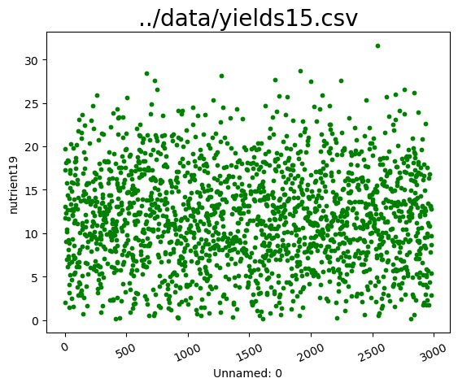

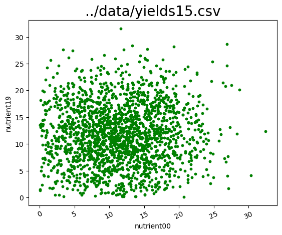

.
.
.
.

Read dataset with a drop column. 

```python
df = pd.read_csv(fn).drop(columns=['Unnamed: 0'], axis =1)
df
```
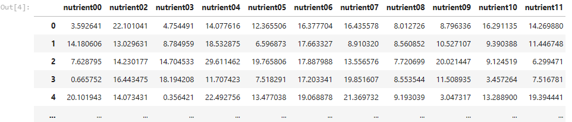

## Linear Regression 
Line intercept

```python
import scipy
x_col,y_col = [0,2]
x = df[df.columns[x_col]]
y = df[df.columns[y_col]]

slope, intercept, r, p, stderr = scipy.stats.linregress(x, y)
fig, ax = plt.subplots()
ax.plot(x, y, linewidth=0, marker='s')
ax.plot(x, intercept + slope * x)
ax.set_xlabel('x')
ax.set_ylabel('y')
plt.show()
```
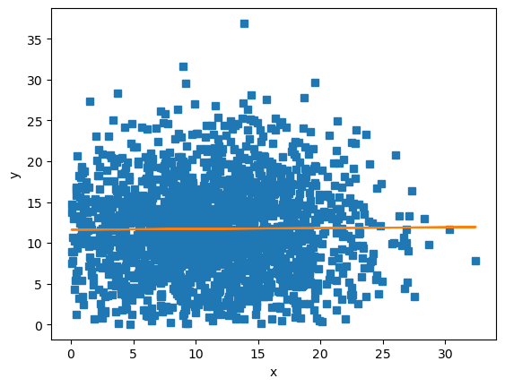

The p-value is the probability of observing a non-zero correlation coefficient in our sample data when in fact the null hypothesis is true. A low p-value would lead you to reject the null hypothesis. A typical threshold for rejection of the null hypothesis is a p-value of 0.05.

```python
import numpy as np
import scipy.stats
#list(df.columns)
#x = df['nutrient00']
x = df['nutrient02']
y = df['yield']
scipy.stats.spearmanr(x, y) 
```
Output: SpearmanrResult(correlation=0.06612890569655992, pvalue=0.003986990967963364)

```python
import numpy as np
import scipy.stats

#list(df.columns)
x = df['nutrient00']
# x = df['nutrient02']
y = df['yield']
scipy.stats.spearmanr(x, y) 
```
Output: SpearmanrResult(correlation=0.11827723808227203, pvalue=2.441043855279039e-07)

## Correlation Matrix 
One way of calculating correlaton matrix just calculated the correlation matrix among three attributes only.

```python
xyz = np.array([df['nutrient00'],#x
                 df['yield'],#y
                 df['nutrient02']]) #z
# xyz
corr_mat,p_mat = scipy.stats.spearmanr(xyz,axis=1) 
corr_mat
```
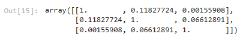

2nd way: Using correlation function on pandas

```python 
corr = df.corr()
corr
```
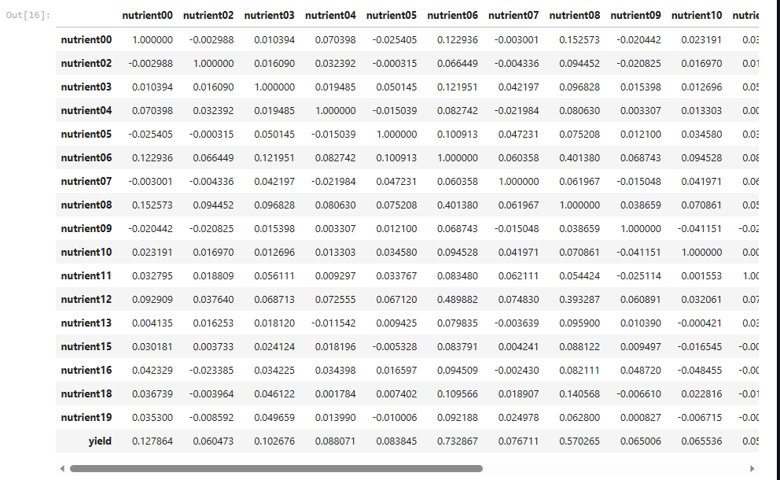

## Heatmap to display the above table.

```python
import seaborn as sn
import matplotlib.pyplot as plt
corr = df.corr(method='spearman')
sn.heatmap(corr, annot=True, fmt = '.1f', linewidth=.5)
plt.show()
```
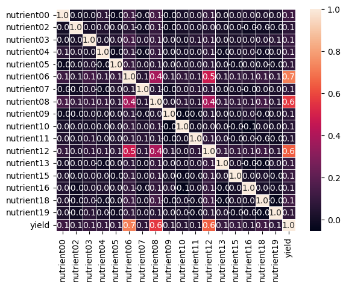

Use a separate dataframe for the annotations:
```python
sn.heatmap(corr, annot=corr.rank(axis="columns"))
plt.show()
```
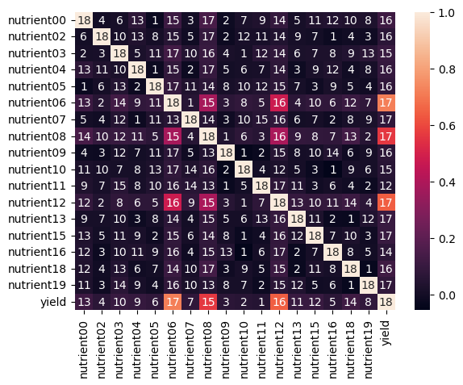

## Preprocessing 
Read the dataset and clean data

```python
from sklearn.decomposition import PCA
from sklearn import preprocessing
import matplotlib.pyplot as plt
import random

yields_file_path = 'yields15.csv'
original_df = pd.read_csv(yields_file_path)
df = original_df.copy()
df = df.drop(columns=['Unnamed: 0'], axis =1)
df = df.dropna(axis=0).reset_index()
df2 = df.dropna(axis=0).reset_index()
```

Define target in the dataset and all selected features for now

```python
y = df['yield']
features = [
 'nutrient00',
 'nutrient02',
 'nutrient03',
 'nutrient04',
 'nutrient05',
 'nutrient06',
 'nutrient07',
 'nutrient08',
 'nutrient09',
 'nutrient10',
 'nutrient11',
 'nutrient12',
 'nutrient13',
 'nutrient15',
 'nutrient16',
 'nutrient18',
 'nutrient19']
X = df[features]
data = X.copy()
data.head()
```

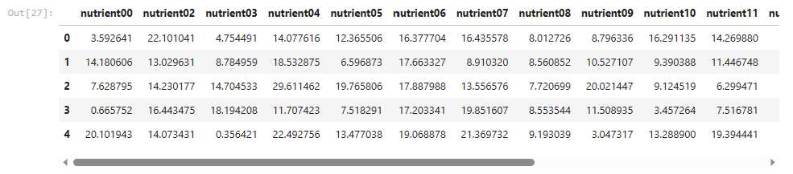

## Data Scaling

```python
scaled_data = preprocessing.scale(data)  # use data.T if samples are columns instead of rows
scaled_data
```
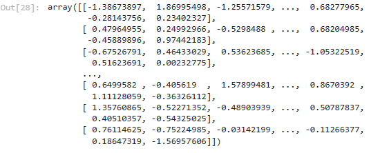

## Doing the PCA
```python
pca = PCA()
pca.fit(scaled_data)
pca_data = pca.transform(scaled_data)

per_var = np.round(pca.explained_variance_ratio_* 100,decimals=1)
labels = ['PC' + str(x) for x in range(1, len(per_var) + 1)]

plt.bar(x = range(1,len(per_var)+1),height=per_var,tick_label = labels)
plt.ylabel('Percentage')
plt.xlabel('Principal comp')
plt.title('Scree plt')
plt.show()
```
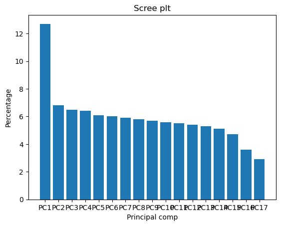

```python
X = X
Y = y
def myplot(score,coeff,labels=None):
    xs = score[:,0]
    ys = score[:,1]
    n = coeff.shape[0]
    scalex = 1.0/(xs.max() - xs.min())
    scaley = 1.0/(ys.max() - ys.min())
    plt.scatter(xs * scalex,ys * scaley, c = y)
    for i in range(n):
        plt.arrow(0, 0, coeff[i,0], coeff[i,1],color = 'r',alpha = 0.5)
        if labels is None:
            plt.text(coeff[i,0]* 1.15, coeff[i,1] * 1.15, "Var"+str(i+1), color = 'g', ha = 'center', va = 'center')
        else:
            plt.text(coeff[i,0]* 1.15, coeff[i,1] * 1.15, labels[i], color = 'g', ha = 'center', va = 'center')
plt.xlim(-1,1)
plt.ylim(-1,1)
plt.xlabel("PC{}".format(1))
plt.ylabel("PC{}".format(2))
plt.grid()
#Call the function. Use only the 2 PCs.
myplot(pca_data,np.transpose(pca.components_),features)
plt.show()
```
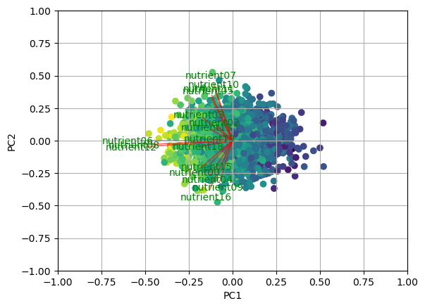

## Load Dataset
Loading key libraries, set target and key features into dataframe and clean data. Set train and test data. 

```python
from sklearn.model_selection import train_test_split
train, test = train_test_split(df, test_size=0.2)
import numpy as np
import pandas as pd
import matplotlib.pyplot as plt
from sklearn.preprocessing import scale 
from sklearn.linear_model import LinearRegression, RidgeCV, LassoCV
from sklearn.model_selection import KFold, cross_val_score, train_test_split
from sklearn.metrics import mean_squared_error
from sklearn.decomposition import PCA
df = pd.read_csv('yields15.csv')
target = 'yield'
X = df.drop(target,axis=1)
X = df.drop(columns = ['Unnamed: 0'])
y = df[target]
X_train, X_test, y_train, y_test = train_test_split(X, y, test_size=0.2, random_state=42)
```
# Standardization

Running standardization on X variables

```python
X_train_scaled = scale(X_train)
X_test_scaled = scale(X_test)
```
# Cross-fold validation
```python
cv = KFold(n_splits=10, shuffle=True, random_state=42)
```
# Different Regression tests
## Linear Regression 
```python
lin_reg = LinearRegression().fit(X_train_scaled, y_train)
lr_score_train = -1 * cross_val_score(lin_reg, X_train_scaled, y_train, cv=cv, scoring='neg_root_mean_squared_error').mean()
lr_score_test = mean_squared_error(y_test, lin_reg.predict(X_test_scaled), squared=False)
```
## Lasso Regression
lasso_reg = LassoCV().fit(X_train_scaled, y_train)
lasso_score_train = -1 * cross_val_score(lasso_reg, X_train_scaled, y_train, cv=cv, scoring='neg_root_mean_squared_error').mean()
lasso_score_test = mean_squared_error(y_test, lasso_reg.predict(X_test_scaled), squared=False)

## Ridge Regression
```python
ridge_reg = RidgeCV().fit(X_train_scaled, y_train)
ridge_score_train = -1 * cross_val_score(ridge_reg, X_train_scaled, y_train, cv=cv, scoring='neg_root_mean_squared_error').mean()
ridge_score_test = mean_squared_error(y_test, ridge_reg.predict(X_test_scaled), squared=False)
```
# Princpal Component Analysis
Generate all the principal components
```python
pca = PCA() # Default n_components = min(n_samples, n_features)
X_train_pc = pca.fit_transform(X_train_scaled)
```
View the first 5 rows of all principal components
```python
pd.DataFrame(pca.components_.T).loc[:4,:]
```
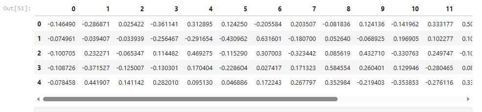

Check for the variances of PCs (principal components)
```python
pca.explained_variance_ratio_
```
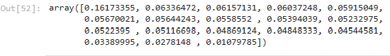

Perform PCA for scaled dataset features

```python 
pca = PCA()
pca.fit(X_train_scaled)
pca_data = pca.transform(X_train_scaled)

per_var = np.round(pca.explained_variance_ratio_* 100,decimals=1)
labels = ['PC' + str(x) for x in range(1, len(per_var) + 1)]

plt.bar(x = range(1,len(per_var)+1),height=per_var,tick_label = labels)
plt.ylabel('Percentage')
plt.xlabel('Principal comp')
plt.title('Scree plt')
plt.show()
```
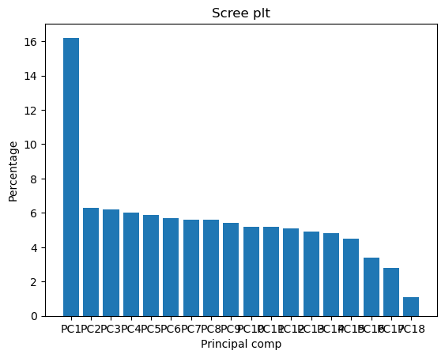

Visually determine optimal number of principal components. Will repeat this step for different number components to consider for next analysis. 

```python
best_pc_num = 2

# Train model with first 9 principal components
lin_reg_pc = LinearRegression().fit(X_train_pc[:,:best_pc_num], y_train)

# Get cross-validation RMSE (train set)
pcr_score_train = -1 * cross_val_score(lin_reg_pc, 
                                       X_train_pc[:,:best_pc_num], 
                                       y_train, 
                                       cv=cv, 
                                       scoring='neg_root_mean_squared_error').mean()

# Train model on training set
lin_reg_pc = LinearRegression().fit(X_train_pc[:,:best_pc_num], y_train)

# Get first 9 principal components of test set
X_test_pc = pca.transform(X_test_scaled)[:,:best_pc_num]

# Predict on test data
preds = lin_reg_pc.predict(X_test_pc)
pcr_score_test = mean_squared_error(y_test, preds, squared=False)

```
Look for better score in case of pcr_score_test. In the above case it happened to be : 0.90318115496449

# Evaluation 
Training set evaluation
```python 
train_metrics = np.array([round(lr_score_train,3), round(lasso_score_train,3), round(ridge_score_train,3), round(pcr_score_train,3)]) 
train_metrics = pd.DataFrame(train_metrics, columns=['RMSE (Train Set)'])
train_metrics.index = ['Linear Regression', 'Lasso Regression', 
                 'Ridge Regression', f'PCR ({best_pc_num} components)']
train_metrics
```
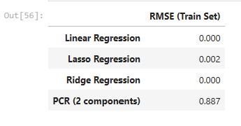

Test set evaluation
```python
test_metrics = np.array([round(lr_score_test,3), round(lasso_score_test,3), round(ridge_score_test,3), round(pcr_score_test,3)]) 
test_metrics = pd.DataFrame(test_metrics, columns=['RMSE (Test Set)'])
test_metrics.index = ['Linear Regression', 'Lasso Regression', 
                      'Ridge Regression', f'PCR ({best_pc_num} components)']
test_metrics
```
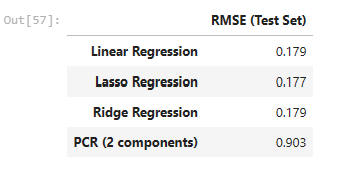
