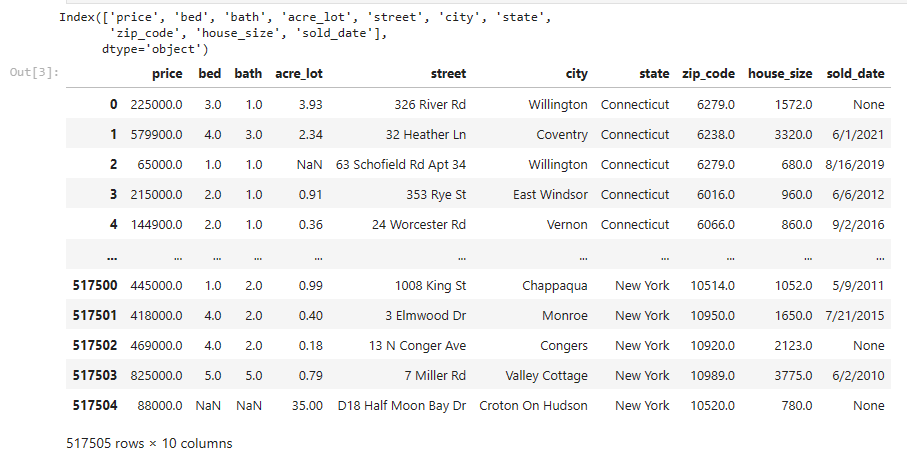
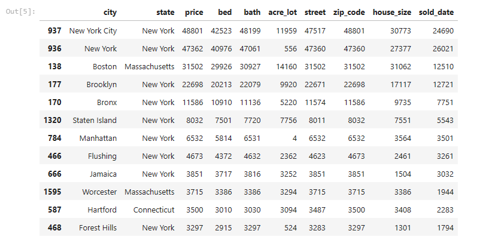
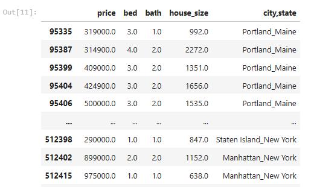
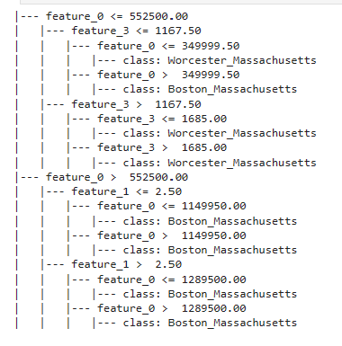
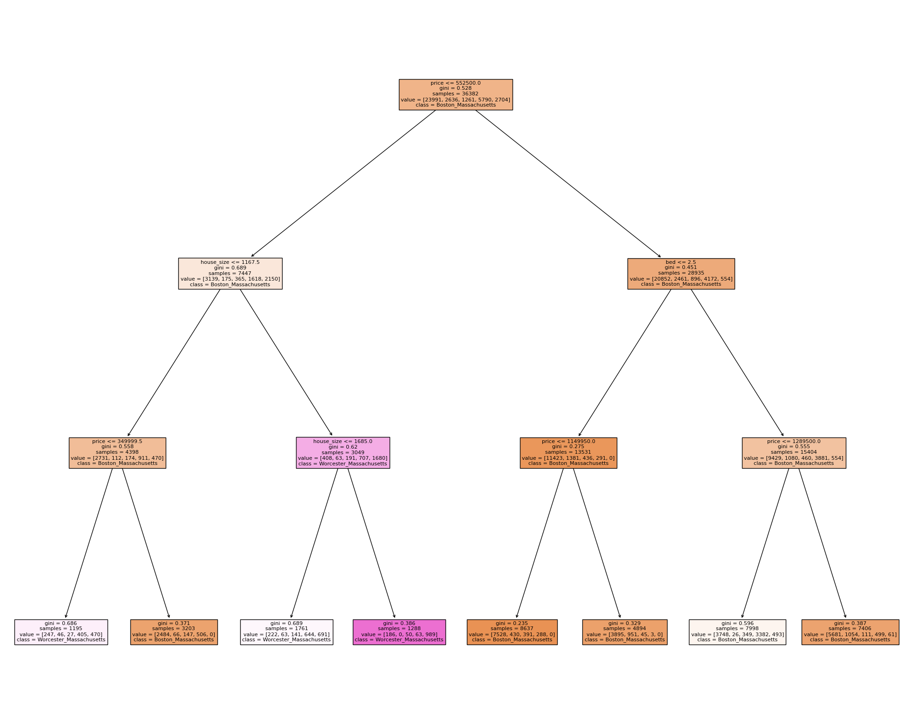
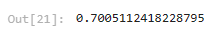
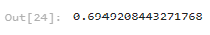

### Applied Machine Learning

1. Decision Trees

#### Load data 
```python 
fn = "northeast_realestate.parquet"
df = pd.read_parquet(fn)
print(df.columns)
df
```


Group by first 'city' and then 'state':

```python
towns = df.groupby(['city','state'],as_index=False).count().sort_values('price',ascending=False)
towns.head(20)
```


Creating new column in dataframe
```python
df['city,state']=df['city']+'_'+df['state']
df
```
Reading only certain city and states instances
```python
top_towns = ['Staten Island_New York','Worcester_Massachusetts','Boston_Massachusetts','Manhattan_New York','Portland_Maine']
df_top = df[df['city,state'].isin(top_towns)]
df_top = df_top[['price','bed','bath','house_size','city,state']].dropna()
df_top
```


# Decision Tree Classifier

```python 
model = DecisionTreeClassifier(random_state=7,max_depth=3)
_,classes = pd.factorize(df_top['city,state'])
print(classes)
features = ['price','bed','bath','house_size']
X = df_top[features]
y = df_top[['city,state']]

X_train, X_test, y_train, y_test = train_test_split(X, y,
                                            train_size=0.8,
                                            random_state=66) 
model.fit(X_train,y_train)
print(model.classes_)
```

```python 
text_representation = tree.export_text(model)
print(text_representation)
```
Decision tree will shape like following: 



Above model - Decision tree plot will look like: 

```python 
fig = plt.figure(figsize=(25,20))
_ = tree.plot_tree(model, 
                   feature_names=['price','bed','bath','house_size'],  
                   class_names=model.classes_,
                   filled=True)
```



# Prediction - Evaluation of model
Training set: 

```python 
from sklearn import metrics

y_pred = model.predict(X_train)
metrics.accuracy_score(y_train,y_pred)
```


Test set: 

```python 
y_pred_test = model.predict(X_test)
metrics.accuracy_score(y_test,y_pred_test)
```


