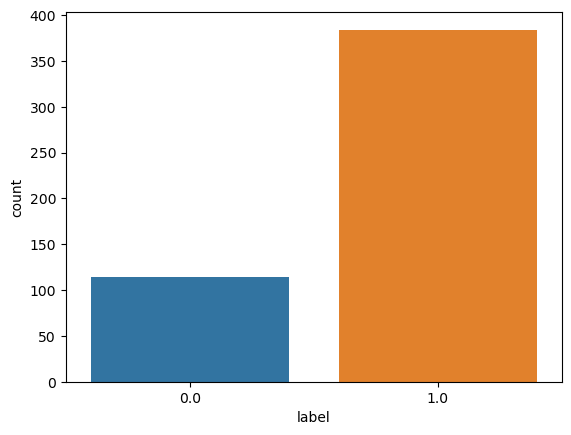
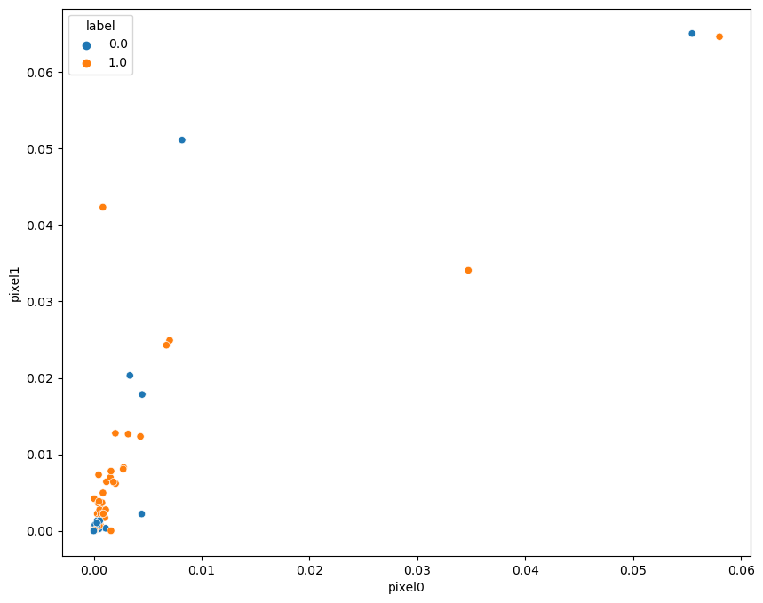
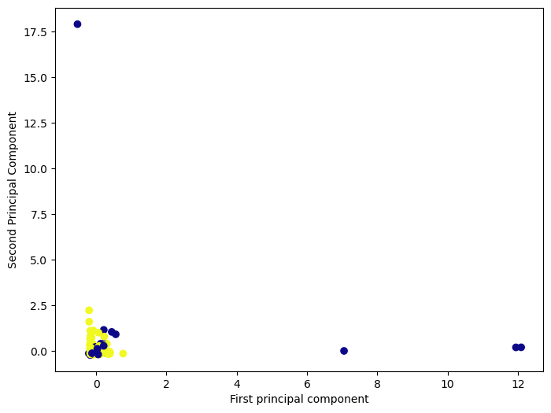
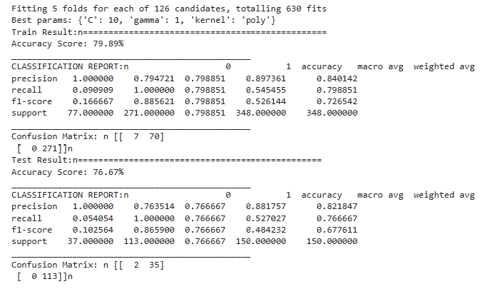
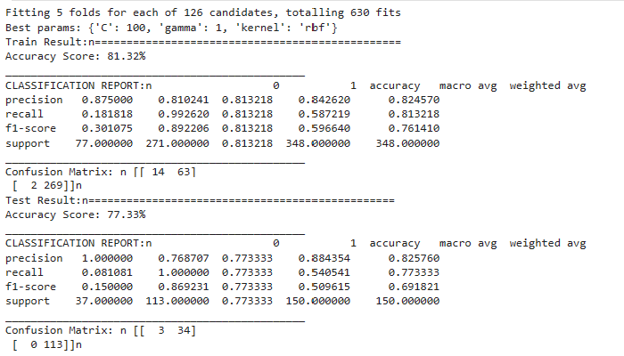

### Applied Machine Learning

1. Applying SVM using PCA - Audio data

#### Load data 
```python 
df=pd.read_csv('../data/train_data.zip',compression='zip')
df=df.fillna(0)
import seaborn as sns
df.describe()
```


To check if the dataset is balance in terms of labels per class

```python
sns.countplot(df['label'], label = 'Count')
```


Using Scatter plot to see how the data is distributed classwise. 
```python
plt.figure(figsize=(10,8))
sns.scatterplot(x='pixel0', y='pixel1', hue='label', data=df)
```


Set target variable and features for model training. Total number of features available per audio instance are 5761 shown in the shape of the datafram printed at last. 

```python
from sklearn.model_selection import cross_val_score, train_test_split
from sklearn.preprocessing import StandardScaler, MinMaxScaler
target  = 'label'
X = df.drop(target, axis=1)
y = df[target].values.astype(int)

print(f" 'X' shape: {X.shape}")
print(f" 'y' shape: {y.shape}")
```
 * 'X' shape: (498, 5761)
 * 'y' shape: (498,)

#### Train and test split

```python 
X_train, X_test, y_train, y_test = train_test_split(X, y, test_size=0.30, random_state=10)
```
## Data Scaling

* Run the features through PCA
* Create a PCA object, use the fit method to discover the principle components, 
* Then use transform to rotate and reduce the dimensionality.

```python
from sklearn.decomposition import PCA
pca = PCA(n_components=2)
scaler = StandardScaler()
X_train= pca.fit_transform(X_train)
X_test = pca.transform(X_test)
X_train = scaler.fit_transform(X_train)
X_test = scaler.transform(X_test)
```
Ploting first component analysis feature vs 2nd component analysis feature. Use PCA for this dataset because there are around 5762 components in this dataset, which will create mess of calculations for loading data into the memory, we need to use the power of PCA to reduce the principle components in this step above I have used two PCs only and produce the results in the lower cell. 

```python 
plt.figure(figsize=(8,6))
plt.scatter(X_train[:,0],X_train[:,1],c=y_train,cmap='plasma')
plt.xlabel('First principal component')
plt.ylabel('Second Principal Component')
```



Set up the hypterparameters for model and fit the model. Results are below. 

```python 
param_grid = {'C': [0.01, 0.1, 0.5, 1, 10, 100], 
              'gamma': [1, 0.75, 0.5, 0.25, 0.1, 0.01, 0.001], 
              'kernel': ['rbf', 'poly', 'linear']} 
grid = GridSearchCV(SVC(), param_grid, refit=True, verbose=1, cv=5)
grid.fit(X_train, y_train)
best_params = grid.best_params_
print(f"Best params: {best_params}")
svm_clf = SVC(**best_params)
svm_clf.fit(X_train, y_train)
print_score(svm_clf, X_train, y_train, X_test, y_test, train=True)
print_score(svm_clf, X_train, y_train, X_test, y_test, train=False)
```


If we take first 3 PCA's then results are improved as such: 



To Save the model as pickle file. 

```python
pickle.dump(model,open('model.sav','wb'))
```

