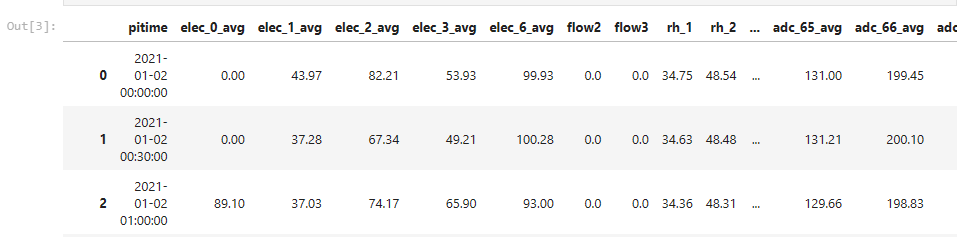
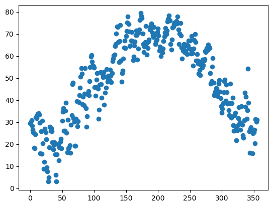
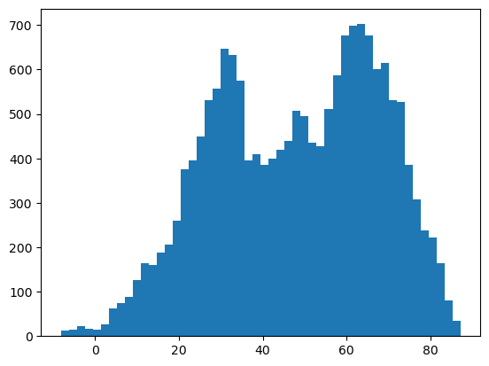
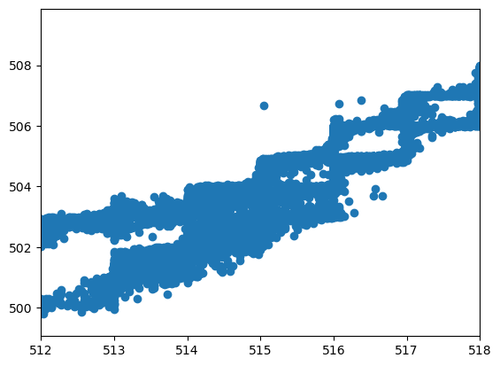
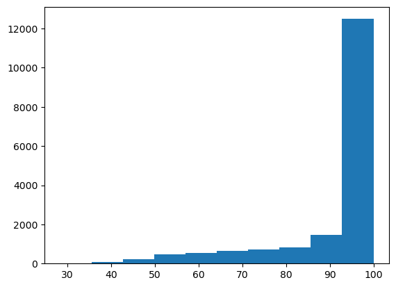
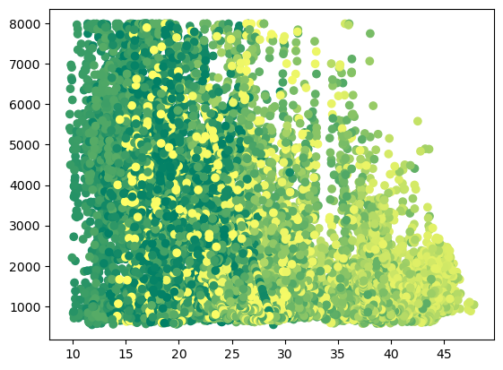
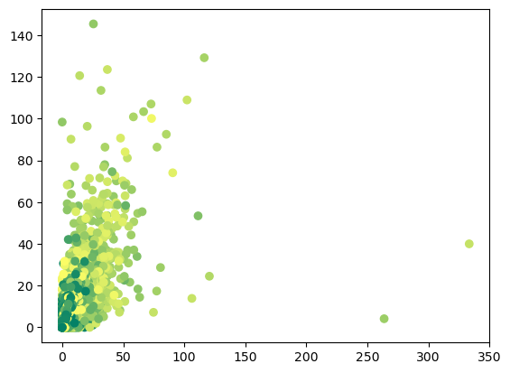

### Applied Machine Learning

1. Data Visualization 

In the tasks visualized homesensor data using python tools to see what attributes of data are in relation to each other and be used to treat the problem as machine learning problem. 
Data Description by reading .csv file: 
```python
import pandas as pd 
import matplotlib.pyplot as plt
df = pd.read_csv('homesensors_2021.csv')
df.head(10)
```


To draw a scatter plot of outside temperature over the entire year - used 48 row window to extract the average of month and plotted using matplotlib.
```python
df2 = df.filter(['pitime', 'temp_8'])
temp_avg_a = []
c = 0
sum = 0 

for index, row in df2.iterrows():
    if c!= 48: 
        sum = sum + row['temp_8']
        c = c + 1
    elif c==48: 
        result = sum/48
        sum = 0
        c = 0 
        temp_avg_a.append(result)

plt.scatter(x =range(0,356), y = temp_avg_a)
plt.show()       
```


Draw a histogram of temperature binned into 50 bins over the whole year

```python
plt.hist(df['temp_8'], bins= 50)
plt.show()
```


Draw a scatter plot of 'adc_67_avg' as x and 'adc_68_avg' as y, with an x range of 512-518
What might cause the stepping pattern in the relationship?
Through this exploration we suggest that, the stepping pattern might be the cause of liquid body in the basement that is causing increase in the moisture or there might be some pip leakage.

```python
plt.scatter(df['adc_67_avg'], df['adc_68_avg'])
plt.xlim(512, 518)
plt.show()
```


To draw a histogram of the outdoor relative humidity.
We see the distribution is not normal and the biasness is due temperature change in outside as the temperature changes and we move from spring to winter season the humidity level increases

```python
plt.hist(df['rh_3'], bins=10)
plt.show()
```


Draw a scatter plot of rh_4 to co2 colored by temp_8.  Use the 'summer' cmap

```python
plt.scatter(df['rh_4'], df['co2'], c = pd.factorize(df['temp_8'])[0])
plt.summer()
plt.show()
```


Draw a scatter plot of 'motion front yard right' and 'motion front yard left'.  use outside temperature as you color. Scatter plot color is in accordance with the outside temperature which create biasness in the data for the period of time where temperature is in certain range the motion sensors are triggered. Colors help in visulization that the events are triggered in at certain temperature - season.

```python
plt.scatter(df['trpin_40_sampleson'], df['trpin_44_sampleson'], c = pd.factorize(df['temp_8'])[0])
plt.show()
```


2. Data Manipulation 
3. Prediction using iterative approach
4. Data preparation
5. Principal Component Analysis - PCA
6. Decision Trees
7. PCA and SVM
8. Model Evaluations - Confusion Matrix
9. Convoultional Neural Networks - CNN

